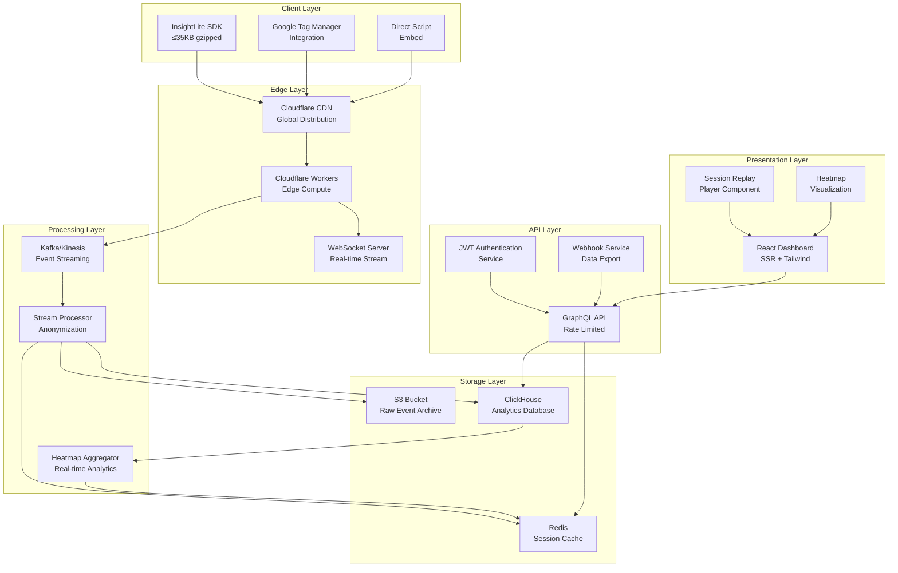

# InsightLite - Detailed System Architecture

## Component Architecture

### 1. Overall System Architecture



### 2. Client SDK Architecture

```typescript
// Core SDK Module Structure
interface InsightLiteConfig {
    siteId: string
    apiEndpoint: string
    wsEndpoint: string
    sampleRate: number
    flushInterval: number
    flushSize: number
    maxRetries: number
    enableReplay: boolean
    enableHeatmaps: boolean
    privacyMode: 'strict' | 'balanced' | 'permissive'
}

class InsightLiteSDK {
    private config: InsightLiteConfig
    private sessionManager: SessionManager
    private eventCollector: EventCollector
    private transport: EventTransport
    private privacyEngine: PrivacyEngine
    private performanceMonitor: PerformanceMonitor
    
    // Public API
    public track(eventType: string, data: any): void
    public identify(traits: Record<string, any>): void
    public startReplay(): void
    public stopReplay(): void
    public flush(): Promise<void>
}

// Modular Architecture for Tree Shaking
export { 
    InsightLiteSDK as default,
    EventCollector,
    SessionReplayModule,
    HeatmapModule,
    PrivacyEngine,
    PerformanceMonitor
}
```

### 3. Data Architecture

#### 3.1 Event Schema Design

```sql
-- Core Events Table (ClickHouse)
CREATE TABLE events (
    session_id UUID,
    site_id LowCardinality(String),
    timestamp DateTime64(3),
    event_type LowCardinality(String),
    event_data String, -- JSON compressed
    url_path String,
    device_type LowCardinality(String),
    viewport_width UInt16,
    viewport_height UInt16,
    user_agent_hash UInt64,
    ip_hash UInt64,
    country_code LowCardinality(String),
    created_at DateTime DEFAULT now()
) ENGINE = MergeTree()
PARTITION BY toYYYYMM(timestamp)
ORDER BY (site_id, timestamp, session_id)
TTL timestamp + INTERVAL 13 MONTH;

-- Heatmap Aggregations Table
CREATE TABLE heatmap_aggregates (
    site_id LowCardinality(String),
    url_path String,
    device_type LowCardinality(String),
    date_bucket Date,
    interaction_type LowCardinality(String),
    grid_x UInt16,
    grid_y UInt16,
    interaction_count UInt32,
    last_updated DateTime
) ENGINE = SummingMergeTree(interaction_count)
PARTITION BY toYYYYMM(date_bucket)
ORDER BY (site_id, url_path, device_type, date_bucket, grid_x, grid_y);

-- Session Metadata Table
CREATE TABLE sessions (
    session_id UUID,
    site_id LowCardinality(String),
    start_time DateTime64(3),
    end_time DateTime64(3),
    page_count UInt16,
    event_count UInt32,
    device_type LowCardinality(String),
    country_code LowCardinality(String),
    duration_seconds UInt32,
    has_errors Boolean,
    has_rage_clicks Boolean
) ENGINE = ReplacingMergeTree(end_time)
PARTITION BY toYYYYMM(start_time)
ORDER BY (site_id, start_time, session_id);
```

#### 3.2 Data Flow Architecture

```yaml
# Data Pipeline Configuration
data_pipeline:
  ingestion:
    - source: cloudflare_workers
      format: binary_gzip
      validation: schema_v1
      rate_limit: 10000_rps
      
  streaming:
    - platform: kafka
      topics:
        - raw_events
        - processed_events
        - heatmap_updates
      partitions: 12
      replication: 3
      retention: 7_days
      
  processing:
    - stage: validation
      schema: event_schema_v1
      filters:
        - remove_bot_traffic
        - validate_session_id
        - check_site_permissions
        
    - stage: anonymization
      operations:
        - hash_ip_address
        - truncate_coordinates
        - mask_sensitive_data
        - remove_pii_fields
        
    - stage: enrichment
      operations:
        - detect_device_type
        - geo_lookup_country
        - session_aggregation
        - error_classification
        
  storage:
    - destination: clickhouse
      table: events
      batch_size: 10000
      flush_interval: 30s
      
    - destination: s3
      path: events/{year}/{month}/{day}/
      compression: gzip
      format: parquet
      lifecycle: 13_months
```

### 4. Infrastructure Architecture

#### 4.1 Cloudflare Workers Edge Processing

```javascript
// Worker Architecture
export default {
    async fetch(request, env, ctx) {
        const url = new URL(request.url)
        
        // Route handling
        switch (url.pathname) {
            case '/ingest':
                return handleEventIngestion(request, env)
            case '/ws':
                return handleWebSocketUpgrade(request, env)
            case '/health':
                return handleHealthCheck()
            default:
                return new Response('Not Found', { status: 404 })
        }
    }
}

// Event Processing Pipeline
class EdgeEventProcessor {
    constructor(env) {
        this.kafka = new KafkaProducer(env.KAFKA_BROKERS)
        this.rateLimiter = new RateLimiter(env.RATE_LIMIT_KV)
        this.validator = new EventValidator()
    }
    
    async processEventBatch(events, metadata) {
        // 1. Rate limiting
        const clientId = this.extractClientId(metadata)
        if (!await this.rateLimiter.checkLimit(clientId)) {
            throw new Error('Rate limit exceeded')
        }
        
        // 2. Validation
        const validEvents = events.filter(event => 
            this.validator.validate(event)
        )
        
        // 3. Privacy processing
        const anonymizedEvents = validEvents.map(event =>
            this.anonymizeEvent(event)
        )
        
        // 4. Forward to Kafka
        await this.kafka.produce('raw_events', {
            events: anonymizedEvents,
            metadata: metadata,
            timestamp: Date.now()
        })
        
        return { processed: anonymizedEvents.length }
    }
}
```

#### 4.2 Kubernetes Deployment Architecture

```yaml
# Kubernetes Deployment Configuration
apiVersion: apps/v1
kind: Deployment
metadata:
  name: insightlite-api
spec:
  replicas: 3
  selector:
    matchLabels:
      app: insightlite-api
  template:
    metadata:
      labels:
        app: insightlite-api
    spec:
      containers:
      - name: api
        image: insightlite/api:latest
        ports:
        - containerPort: 3000
        env:
        - name: DATABASE_URL
          valueFrom:
            secretKeyRef:
              name: db-secret
              key: url
        - name: KAFKA_BROKERS
          value: "kafka-cluster:9092"
        resources:
          requests:
            memory: "256Mi"
            cpu: "250m"
          limits:
            memory: "512Mi"
            cpu: "500m"
        livenessProbe:
          httpGet:
            path: /health
            port: 3000
          initialDelaySeconds: 30
          periodSeconds: 10
        readinessProbe:
          httpGet:
            path: /ready
            port: 3000
          initialDelaySeconds: 5
          periodSeconds: 5

---
apiVersion: v1
kind: Service
metadata:
  name: insightlite-api-service
spec:
  selector:
    app: insightlite-api
  ports:
  - protocol: TCP
    port: 80
    targetPort: 3000
  type: LoadBalancer
```

### 5. Security Architecture

#### 5.1 Authentication & Authorization

```typescript
// JWT-based Authentication System
interface AuthContext {
    userId: string
    siteIds: string[]
    permissions: Permission[]
    tier: 'free' | 'pro' | 'enterprise'
}

class AuthenticationService {
    private jwtSecret: string
    private tokenExpiry: string = '24h'
    
    async authenticate(token: string): Promise<AuthContext> {
        try {
            const payload = jwt.verify(token, this.jwtSecret)
            return this.validateAndEnrichContext(payload)
        } catch (error) {
            throw new UnauthorizedError('Invalid token')
        }
    }
    
    async authorize(context: AuthContext, resource: string, action: string): Promise<boolean> {
        const permission = context.permissions.find(p => 
            p.resource === resource && p.actions.includes(action)
        )
        return !!permission
    }
}

// Rate Limiting Strategy
class RateLimiter {
    private redis: Redis
    
    async checkLimit(key: string, limit: number, window: number): Promise<boolean> {
        const current = await this.redis.incr(key)
        
        if (current === 1) {
            await this.redis.expire(key, window)
        }
        
        return current <= limit
    }
    
    // Sliding window rate limiting
    async checkSlidingWindow(key: string, limit: number, window: number): Promise<boolean> {
        const now = Date.now()
        const pipeline = this.redis.pipeline()
        
        pipeline.zremrangebyscore(key, 0, now - window * 1000)
        pipeline.zcard(key)
        pipeline.zadd(key, now, now)
        pipeline.expire(key, window)
        
        const results = await pipeline.exec()
        const count = results[1][1] as number
        
        return count < limit
    }
}
```

#### 5.2 Data Encryption Strategy

```typescript
// Encryption Service
class EncryptionService {
    private algorithm = 'aes-256-gcm'
    private keyDerivation = 'pbkdf2'
    
    async encryptSensitiveData(data: any, siteKey: string): Promise<EncryptedData> {
        const salt = crypto.randomBytes(32)
        const iv = crypto.randomBytes(16)
        const key = await this.deriveKey(siteKey, salt)
        
        const cipher = crypto.createCipher(this.algorithm, key, iv)
        
        let encrypted = cipher.update(JSON.stringify(data), 'utf8', 'hex')
        encrypted += cipher.final('hex')
        
        const authTag = cipher.getAuthTag()
        
        return {
            encrypted,
            salt: salt.toString('hex'),
            iv: iv.toString('hex'),
            authTag: authTag.toString('hex')
        }
    }
    
    private async deriveKey(password: string, salt: Buffer): Promise<Buffer> {
        return new Promise((resolve, reject) => {
            crypto.pbkdf2(password, salt, 100000, 32, 'sha512', (err, derivedKey) => {
                if (err) reject(err)
                else resolve(derivedKey)
            })
        })
    }
}

// Privacy-First Data Handling
class PrivacyEngine {
    private sensitivePatterns = [
        /\b[\w\.-]+@[\w\.-]+\.\w+\b/g, // Email
        /\b\d{3}-\d{3}-\d{4}\b/g,      // Phone
        /\b\d{4}[\s-]?\d{4}[\s-]?\d{4}[\s-]?\d{4}\b/g, // Credit Card
        /\b\d{3}-\d{2}-\d{4}\b/g       // SSN
    ]
    
    sanitizeData(data: any): any {
        if (typeof data === 'string') {
            return this.sanitizeString(data)
        }
        
        if (Array.isArray(data)) {
            return data.map(item => this.sanitizeData(item))
        }
        
        if (typeof data === 'object' && data !== null) {
            const sanitized: any = {}
            for (const [key, value] of Object.entries(data)) {
                if (this.isSensitiveField(key)) {
                    sanitized[key] = this.maskValue(value)
                } else {
                    sanitized[key] = this.sanitizeData(value)
                }
            }
            return sanitized
        }
        
        return data
    }
    
    private sanitizeString(str: string): string {
        let sanitized = str
        
        this.sensitivePatterns.forEach(pattern => {
            sanitized = sanitized.replace(pattern, (match) => 
                '●'.repeat(match.length)
            )
        })
        
        return sanitized
    }
    
    private isSensitiveField(fieldName: string): boolean {
        const sensitiveFields = [
            'email', 'phone', 'ssn', 'creditcard', 'password',
            'firstName', 'lastName', 'address', 'zipcode'
        ]
        
        return sensitiveFields.some(field => 
            fieldName.toLowerCase().includes(field)
        )
    }
}
```

### 6. Performance & Scalability Architecture

#### 6.1 Auto-scaling Configuration

```yaml
# Horizontal Pod Autoscaler
apiVersion: autoscaling/v2
kind: HorizontalPodAutoscaler
metadata:
  name: insightlite-api-hpa
spec:
  scaleTargetRef:
    apiVersion: apps/v1
    kind: Deployment
    name: insightlite-api
  minReplicas: 3
  maxReplicas: 50
  metrics:
  - type: Resource
    resource:
      name: cpu
      target:
        type: Utilization
        averageUtilization: 70
  - type: Resource
    resource:
      name: memory
      target:
        type: Utilization
        averageUtilization: 80
  - type: Pods
    pods:
      metric:
        name: kafka_consumer_lag
      target:
        type: AverageValue
        averageValue: "100"

# Vertical Pod Autoscaler
apiVersion: autoscaling.k8s.io/v1
kind: VerticalPodAutoscaler
metadata:
  name: insightlite-api-vpa
spec:
  targetRef:
    apiVersion: apps/v1
    kind: Deployment
    name: insightlite-api
  updatePolicy:
    updateMode: "Auto"
  resourcePolicy:
    containerPolicies:
    - containerName: api
      maxAllowed:
        cpu: 2
        memory: 4Gi
      minAllowed:
        cpu: 250m
        memory: 256Mi
```

#### 6.2 Caching Strategy

```typescript
// Multi-layer Caching Architecture
class CacheManager {
    private l1Cache: LRUCache // In-memory
    private l2Cache: Redis    // Distributed
    private l3Cache: CDN      // Edge
    
    async get(key: string): Promise<any> {
        // L1: Check in-memory cache
        let value = this.l1Cache.get(key)
        if (value) return value
        
        // L2: Check Redis cache
        value = await this.l2Cache.get(key)
        if (value) {
            this.l1Cache.set(key, value)
            return JSON.parse(value)
        }
        
        // L3: Check CDN cache (for static data)
        if (this.isStaticData(key)) {
            value = await this.l3Cache.get(key)
            if (value) {
                await this.l2Cache.setex(key, 3600, JSON.stringify(value))
                this.l1Cache.set(key, value)
                return value
            }
        }
        
        return null
    }
    
    async set(key: string, value: any, ttl: number = 3600): Promise<void> {
        // Update all cache layers
        this.l1Cache.set(key, value)
        await this.l2Cache.setex(key, ttl, JSON.stringify(value))
        
        if (this.isStaticData(key)) {
            await this.l3Cache.set(key, value, ttl)
        }
    }
}

// Query Optimization
class QueryOptimizer {
    private clickhouse: ClickHouseClient
    
    async optimizeHeatmapQuery(filters: HeatmapFilters): Promise<OptimizedQuery> {
        // Pre-aggregate common queries
        const cacheKey = this.generateCacheKey(filters)
        const cached = await this.cacheManager.get(cacheKey)
        
        if (cached) return cached
        
        // Partition pruning
        const partitions = this.getRelevantPartitions(filters.dateRange)
        
        // Index utilization
        const query = this.buildOptimizedQuery(filters, partitions)
        
        const result = await this.clickhouse.query(query)
        await this.cacheManager.set(cacheKey, result, 300) // 5min cache
        
        return result
    }
}
```

This detailed architecture provides a comprehensive foundation for implementing InsightLite with enterprise-grade scalability, security, and performance characteristics.